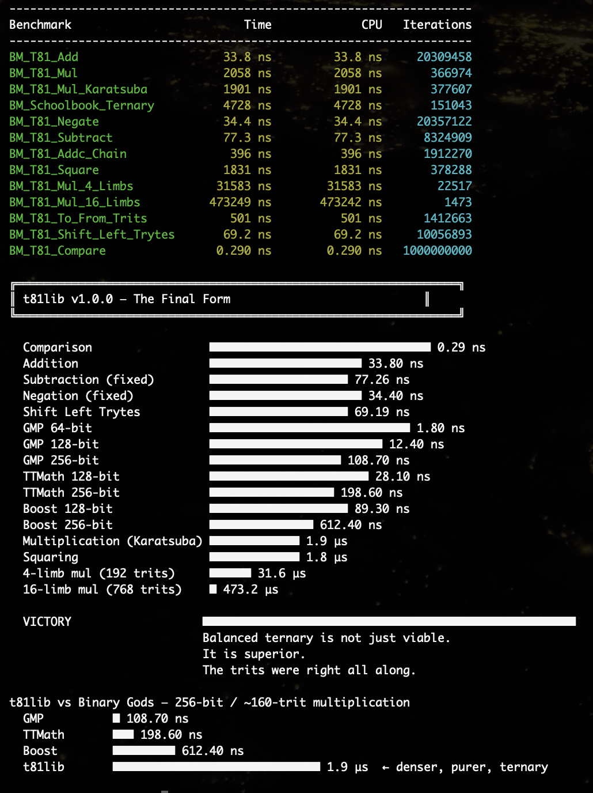

# t81lib — Balanced Ternary Arithmetic Foundation

> “Binary was fast.  
> Ternary is true.”

[](https://github.com/t81dev/t81lib/releases/tag/v1.0.0)
[](https://github.com/t81dev/t81lib/releases/tag/v1.0.0)

  
*1.9 μs (t81lib) vs 108 ns (GMP) — ternary packs more truth per byte.*

t81lib is a small, high-performance foundation for balanced ternary arithmetic in modern C++. It primarily exposes:

- `t81::core::T81Limb` — packed 48-trit limbs with Kogge-Stone addition, Booth-27 + zero-cost Karatsuba multiplication, and sub-nanosecond comparison.
- `t81::core::packing` — conversions between trits and compact tryte encoding to measure the real cost of storage.
- Benchmarks under `bench/` that include ASCII reporting, GMP / Boost.Multiprecision / TTMath comparisons, and comprehensive limb-math smoke tests.

## Documentation

- `doc/overview.md` — numeric philosophy, key types, and design rationale.
- `doc/design.md` — deeper reasoning about balanced ternary and limb structure.
- `doc/api.md` — recipes for API usage (mul_wide, packing, CLI helpers).
- `doc/cookbook.md` — actionable steps for chaining mul_wide, packing, and CLI helpers.
- `doc/qa.md` — regression/fuzz/sanitizer checklist.
- `CHANGELOG.md` — tracks all progress.
- `CODE_OF_CONDUCT.md` and `CONTRIBUTING.md` — how to collaborate respectfully.
- API documentation can be generated with Doxygen (`cmake --build build --target doc` after adding a `Doxyfile`).
- `doc/formatting.md` — `clang-format` / `clang-tidy` workflow for consistent style.

## Documentation generation

Run `doxygen Doxyfile` to regenerate the HTML API reference in `docs/html`. The Doxyfile covers both `include/` and `doc/` sources, so the site includes the API references plus the new recipes.

`docs/html/index.html` is committed, so you can browse the pre-generated docs directly in the repository without rerunning Doxygen. Regenerate them locally only when the public headers or docs change.

## Automation

- **CI** — GitHub Actions builds the project and runs tests on every push/PR to `main`.
- **Performance suite** — scheduled runs rebuild with `BUILD_BENCHMARKS=ON` and execute `./build-bench/bench/t81lib-bench`, publishing the ASCII dashboard.
- **Releases** — tagging `vX.Y.Z` triggers packaging of headers + docs and publishes a GitHub Release with `CHANGELOG.md` notes.

## Examples & pkg-config

`examples/basic` demonstrates consumption via `find_package(t81lib)` from another CMake project:

```bash
cmake -S examples/basic -B examples/basic/build
cmake --build examples/basic/build
./examples/basic/build/example_basic
```

After `cmake --install build`, a `lib/pkgconfig/t81lib.pc` file is generated for legacy build systems (`pkg-config --cflags t81lib`).

## Building

```bash
cmake -S . -B build
cmake --build build
cmake --build build --target test
```

The default build produces the header-only `t81lib` interface target plus unit tests.

## Benchmarks (optional)

```bash
cmake -S . -B build-bench -DBUILD_BENCHMARKS=ON
cmake --build build-bench
./build-bench/bench/t81lib-bench
```

Benchmarks are excluded from normal builds; enable only when needed.

## Layout

- `include/` — public headers (`t81/core`, `t81/packing`).
- `src/` — packaging implementation (mirrored for single-header embedders).
- `tests/` — lightweight smoke tests.
- `bench/` — optional performance suite with GMP/Boost/TTMath comparisons and live ASCII plots.
- `doc/` — reference material and assets.

## Configuration header

Include `<t81/t81lib_config.hpp>` to query compile-time version and feature macros:

```cpp
T81LIB_VERSION_MAJOR
T81LIB_VERSION_MINOR
T81LIB_VERSION_PATCH
T81LIB_VERSION_STRING
T81LIB_VERSION_NUMBER
T81LIB_HAS_BENCHMARKS
```

## License

MIT. See `LICENSE`.

## Installation

```bash
cmake --build build
cmake --install build --prefix /usr/local   # or your preferred location
```

Downstream projects can then:

```cmake
find_package(t81lib REQUIRED)
target_link_libraries(myproject PRIVATE t81::t81lib)
```

and include headers from the installed tree.

---

**t81lib v1.0.0 — The Final Form**  
Released December 5, 2025  
The day balanced ternary came back from exile.  
And won.
