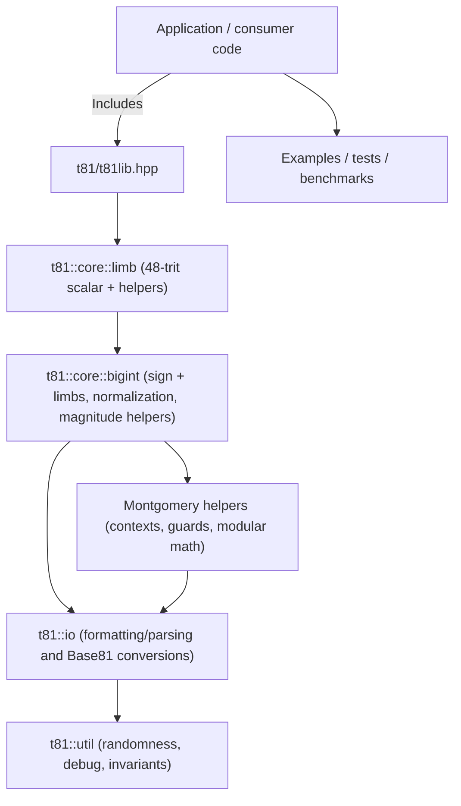

<!--
doc/diagrams/architecture-stack-mermaid.md — Visual guide to the module layering for new contributors.
-->

```mermaid
graph TD
    Application[Application / consumer code] -->|Includes| Umbrella[t81/t81lib.hpp]
    Umbrella --> Limb["t81::core::limb (48-trit scalar + helpers)"]
    Limb --> Bigint["t81::core::bigint (sign + limbs, normalization, magnitude helpers)"]
    Bigint --> Montgomery["Montgomery helpers (contexts, guards, modular math)"]
    Bigint --> IO["t81::io (formatting/parsing and Base81 conversions)"]
    IO --> Util["t81::util (randomness, debug, invariants)"]
    Montgomery --> IO
    Application --> Docs["Examples / tests / benchmarks"]
```
