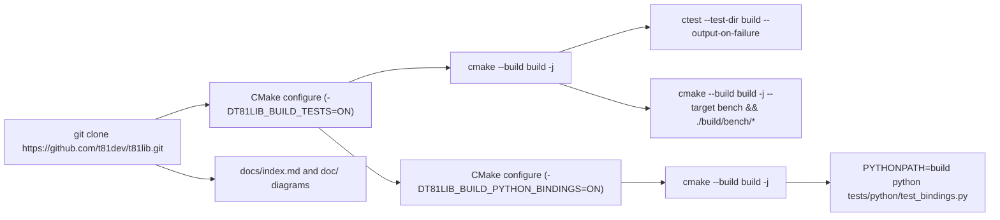

<!--
doc/diagrams/build-flow-mermaid.md — Build, test, and binding workflow for new contributors.
-->

```mermaid
graph LR
    Clone["git clone https://github.com/t81dev/t81lib.git"] --> Configure["CMake configure (-DT81LIB_BUILD_TESTS=ON)"]
    Configure --> Build["cmake --build build -j"]
    Build --> Test["ctest --test-dir build --output-on-failure"]
    Build --> Bench["cmake --build build -j --target bench && ./build/bench/*"]
    Configure --> PythonConfig["CMake configure (-DT81LIB_BUILD_PYTHON_BINDINGS=ON)"]
    PythonConfig --> PythonBuild["cmake --build build -j"]
    PythonBuild --> PyTests["PYTHONPATH=build python tests/python/test_bindings.py"]
    Clone --> Docs["docs/index.md and doc/ diagrams"]
```
