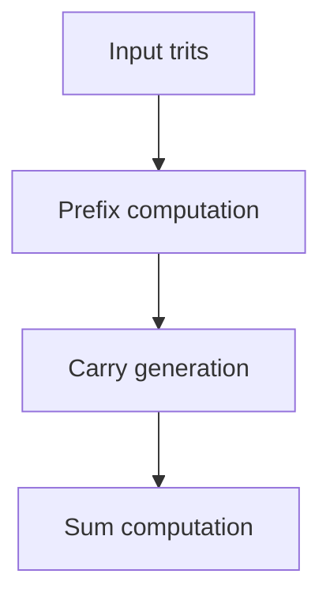

<!--
doc/diagrams/kogge-stone-mermaid.md — Mermaid diagram showing the Kogge-Stone carry propagation design.
-->

```mermaid
graph TD
    A[Input trits] --> B[Prefix computation]
    B --> C[Carry generation]
    C --> D[Sum computation]
```
