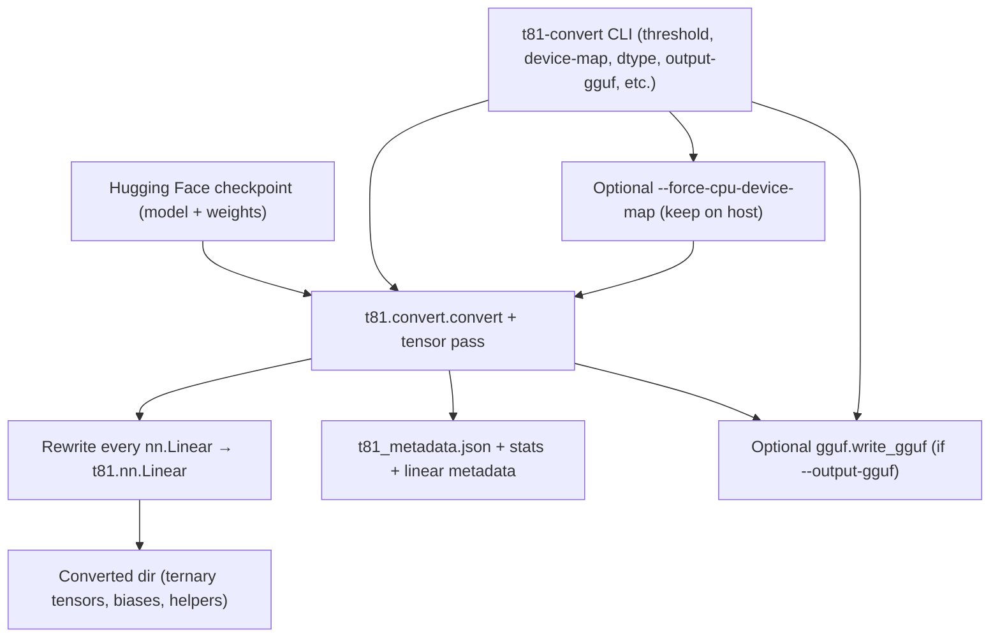
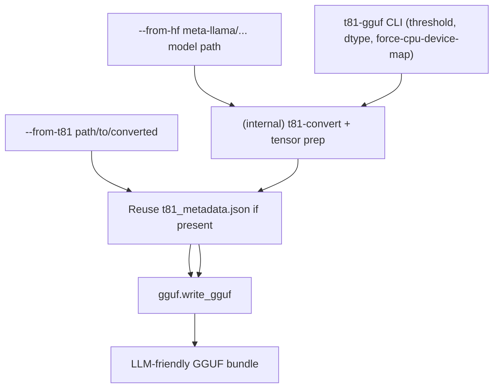
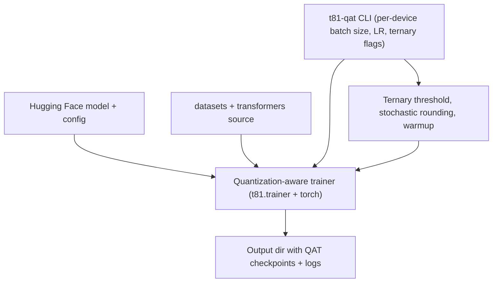

<!--
docs/diagrams/cli-workflows-mermaid.md — Visual guide to the t81 CLI helper workflows.
-->

## CLI workflows

Each helper (`t81-convert`, `t81-gguf`, `t81-qat`) interfaces with Hugging Face + `transformers` to deliver ternary-ready bundles or quantization-aware checkpoints. The diagrams below highlight the entry points, where shared helpers are invoked, and what artifacts land on disk.

### `t81-convert`

### `t81-gguf`

### `t81-qat`

