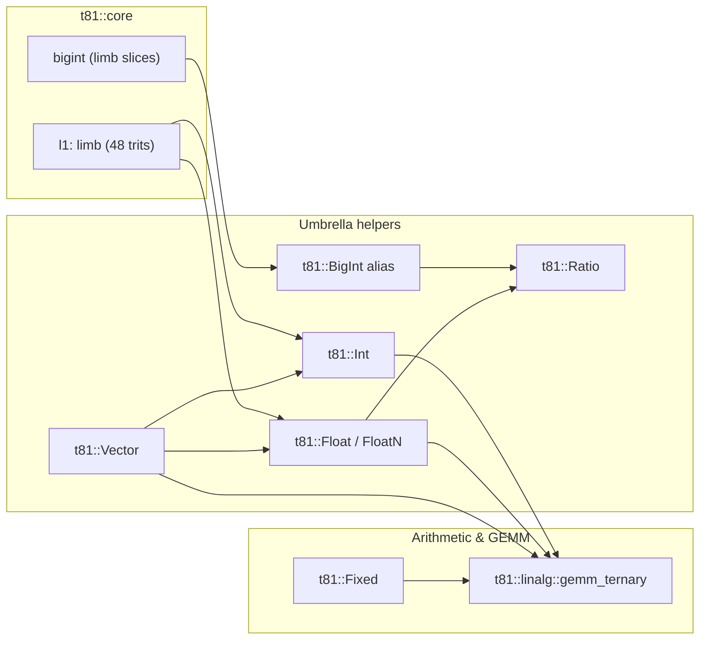

```mermaid
flowchart LR
  subgraph Core["t81::core"]
    limb["l1: limb (48 trits)"]
    bigint["bigint (limb slices)"]
  end

  subgraph HighLevel["Umbrella helpers"]
    Int["t81::Int"]
    Float["t81::Float / FloatN"]
    BigInt["t81::BigInt alias"]
    Ratio["t81::Ratio"]
    Vector["t81::Vector"]
  end

  subgraph Ops["Arithmetic & GEMM"]
    GEMM["t81::linalg::gemm_ternary"]
    Fixed["t81::Fixed<N>"]
  end

  limb --> Int
  limb --> Float
  bigint --> BigInt
  BigInt --> Ratio
  Vector --> Float
  Float --> Ratio
  Vector --> Int

  Int --> GEMM
  Float --> GEMM
  Vector --> GEMM
  Fixed --> GEMM

  %% GitHub-safe click: use repo-relative path (or a full URL)
  click Float "./docs/api-overview.md" "See the helper summary"
```
