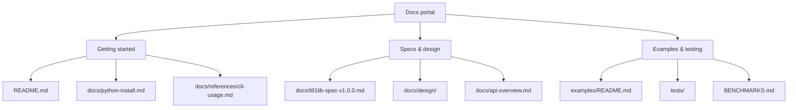

```mermaid
graph TD
    Docs[Docs portal]
    GettingStarted[Getting started]
    Specs[Specs & design]
    Examples[Examples & testing]
    Docs --> GettingStarted
    Docs --> Specs
    Docs --> Examples
    GettingStarted --> README
    GettingStarted --> PythonInstall
    GettingStarted --> CLI
    Specs --> Spec
    Specs --> Design
    Specs --> APIOverview
    Examples --> Demos
    Examples --> Tests
    Examples --> Benchmarks
    README[README.md]
    PythonInstall[docs/python-install.md]
    CLI[docs/references/cli-usage.md]
    Spec[docs/t81lib-spec-v1.0.0.md]
    Design[docs/design/]
    APIOverview[docs/api-overview.md]
    Demos[examples/README.md]
    Tests[tests/]
    Benchmarks[BENCHMARKS.md]
```
