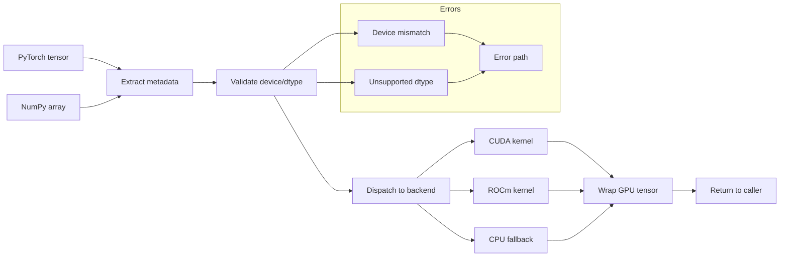

```mermaid
flowchart LR
    torch[PyTorch tensor] --> extract[Extract metadata]
    numpy[NumPy array] --> extract
    extract --> validate[Validate device/dtype]
    validate --> dispatch[Dispatch to backend]
    dispatch --> cuda[CUDA kernel]
    dispatch --> rocm[ROCm kernel]
    dispatch --> cpu[CPU fallback]
    cuda --> wrap[Wrap GPU tensor]
    rocm --> wrap
    cpu --> wrap
    wrap --> return[Return to caller]
    subgraph Errors
        mismatch[Device mismatch] --> error[Error path]
        unsupported[Unsupported dtype] --> error
    end
    validate --> mismatch
    validate --> unsupported
```
