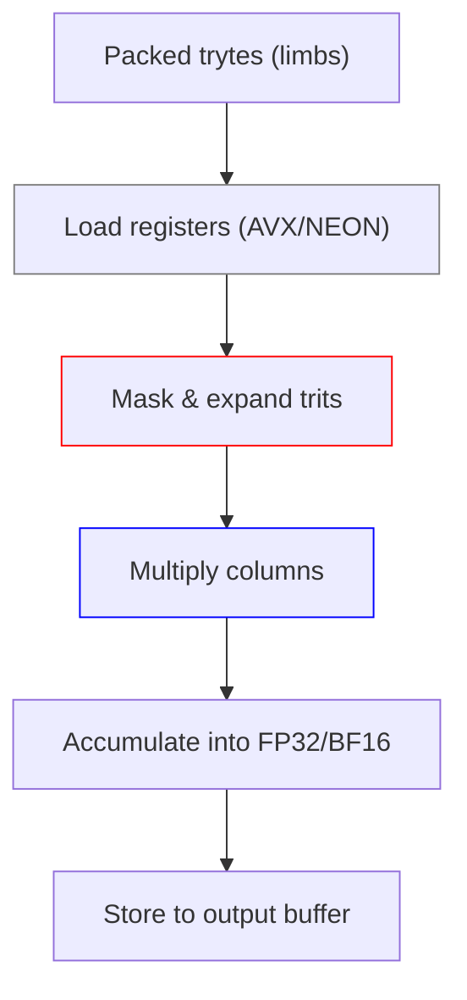

```mermaid
flowchart TB
  tryte["Packed trytes (limbs)"]
  load["Load registers (AVX/NEON)"]
  mask["Mask & expand trits"]
  multiply["Multiply columns"]
  accumulate["Accumulate into FP32/BF16"]
  store["Store to output buffer"]

  tryte --> load --> mask --> multiply --> accumulate --> store

  %% GitHub-friendly styling (avoid hex colors; use named colors)
  style load stroke:gray,stroke-width:1px
  style mask stroke:red,stroke-width:1px
  style multiply stroke:blue,stroke-width:1px

```
