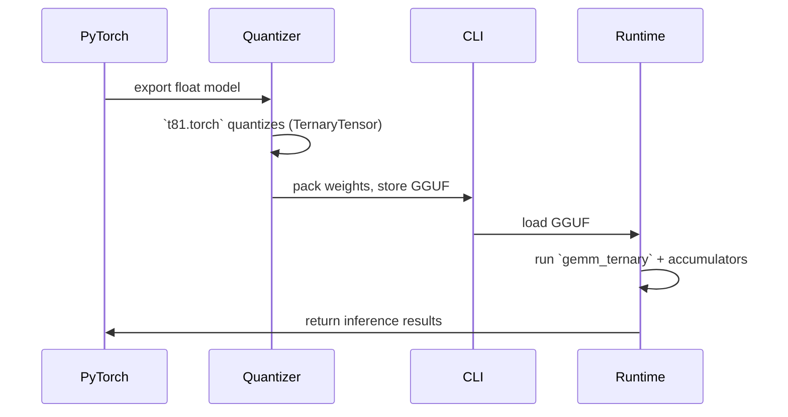

```mermaid
sequenceDiagram
    participant PyTorch
    participant Quantizer
    participant CLI
    participant Runtime

    PyTorch->>Quantizer: export float model
    Quantizer->>Quantizer: `t81.torch` quantizes (TernaryTensor)
    Quantizer->>CLI: pack weights, store GGUF
    CLI->>Runtime: load GGUF
    Runtime->>Runtime: run `gemm_ternary` + accumulators
    Runtime->>PyTorch: return inference results
```
